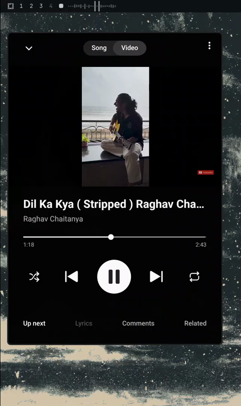

# omacava — CAVA Visualizer with Universal Media Controls

A live CAVA audio spectrum for the Omarchy status bar with universal media
controls. Works with **any** MPRIS player — YouTube Music, Spotify, VLC,
browser tabs, anything that publishes MPRIS.


[](https://github.com/thepathless/omacava/releases/download/v1.0.0/preview.mp4)

## Features

- **Live spectrum** — 24 CAVA bars driven by the system audio (both stereo
  channels combined), with theme-accurate colors
- **Mouse scroll** — increase or decrease the system volume, with an OSD
  toast (icon + %)
- **Mouse hover** — tooltip showing the name of the media being played
  (omamusic-style `title — artist`), or "No media playing" when idle
- **Mouse click** — pause and unpause whatever media is currently playing
  (works with any MPRIS player)
- **Auto-hide** (optional) — widget hides when neither audio nor media is
  present

## Requirements

- `cava` (audio visualizer): `omarchy pkg add cava`
- A running MPRIS player (optional — the spectrum works without one)

## Installation

```bash
omarchy plugin add https://github.com/thepathless/omacava --enable
```

Or add it manually to `~/.config/omarchy/plugins/omacava/` and reference it
in `shell.json` under `bar.layout`:

```json
{ "id": "omacava" }
```

## Configuration

Settings live on the widget entry in `~/.config/omarchy/shell.json`:

| Setting      | Default | Description                                      |
|--------------|---------|--------------------------------------------------|
| `bars`       | `24`    | Number of spectrum bars                          |
| `autoHide`   | `false` | Hide the widget when nothing is playing/audible  |

```json
{ "id": "omacava", "bars": 32, "autoHide": true }
```

## How it works

- `cava.conf` — CAVA config: PipeWire input from the speaker sink's monitor
  (system audio, not the mic), mono (average of L+R), raw ASCII output at 60 fps
- `BarWidget.qml` — spectrum rendering, universal MPRIS player selection,
  volume OSD, and a self-contained `PopupWindow` tooltip (independent of the
  bar's built-in tooltip plumbing)

## License

MIT — see [LICENSE](LICENSE).